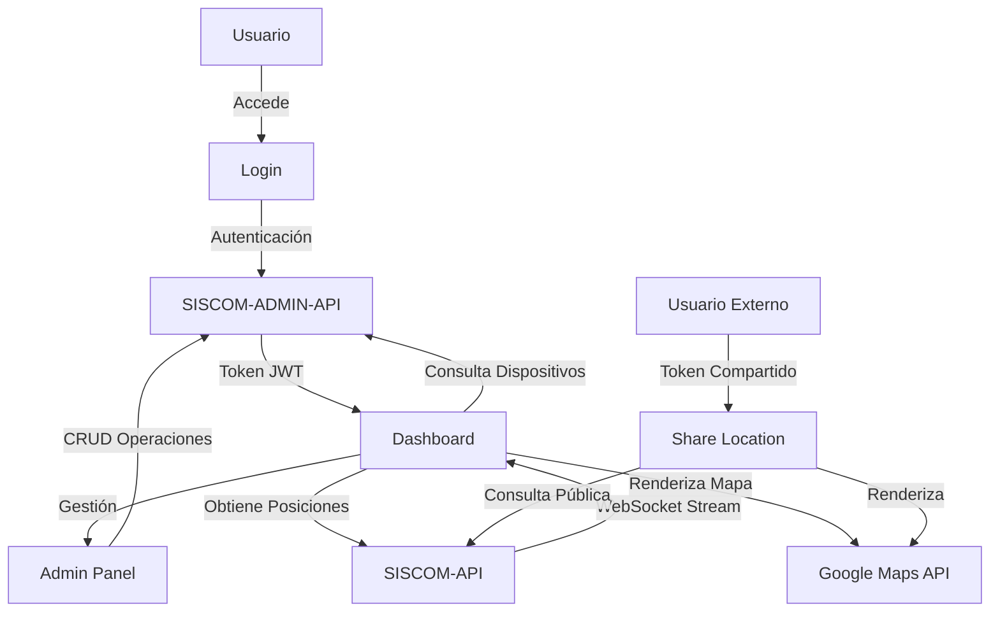

# Module Dependency Documentation

These documents describe which APIs are consumed by each
application module and how they interact at runtime.

This documentation supports C4 container and component diagrams.

---

## 📋 Resumen de Dependencias Externas

### APIs Consumidas

| API | Tipo | URL Base | Uso Principal |
|-----|------|----------|---------------|
| **SISCOM-ADMIN-API** | REST API | `VITE_ADMIN_API_URL` | Autenticación, gestión de usuarios, clientes, dispositivos y unidades |
| **SISCOM-API** | REST + WebSocket | `VITE_COMM_API_URL` | Comunicaciones GPS en tiempo real, posiciones de dispositivos |
| **Google Maps API** | JavaScript API | Google Cloud | Visualización de mapas y marcadores |

### Librerías Externas

| Librería | Versión | Uso |
|----------|---------|-----|
| `@googlemaps/js-api-loader` | ^1.16.10 | Carga del SDK de Google Maps |
| `@jesusCabrera84/map-engine` | ^0.1.12 | Motor de mapas personalizado con animaciones |

---

## 📁 Módulos Documentados

- [**Dashboard**](./dashboard.md) - Vista principal con mapa en tiempo real
- [**Login**](./login.md) - Autenticación de usuarios
- [**Register**](./register.md) - Registro de nuevos clientes
- [**Share Location**](./share-location.md) - Visualización pública de ubicación compartida
- [**Admin Panel**](./admin-panel.md) - Gestión de usuarios, unidades y dispositivos

---

## 🔄 Flujo General de la Aplicación

---

## 🔐 Autenticación

Todos los módulos autenticados utilizan **JWT Bearer Tokens** proporcionados por SISCOM-ADMIN-API:
- `access_token`: Token de acceso (corta duración)
- `refresh_token`: Token de refresco (larga duración)
- `id_token`: Token de identidad

Los tokens se almacenan en `localStorage` y se incluyen en el header `Authorization: Bearer {token}` de todas las peticiones autenticadas.

---

## 📊 Consideraciones de Arquitectura C4

### Nivel 1 - Contexto del Sistema
- **Sistema:** Nexus Web Application
- **Usuarios:** Clientes autenticados, Usuarios invitados, Público (enlaces compartidos)
- **Sistemas Externos:** SISCOM-ADMIN-API, SISCOM-API, Google Maps

### Nivel 2 - Contenedores
- **Web App (SvelteKit):** Aplicación frontend
- **SISCOM-ADMIN-API:** Servicio de administración
- **SISCOM-API:** Servicio de comunicaciones GPS
- **Google Maps API:** Servicio de mapas

### Nivel 3 - Componentes
Ver documentación individual de cada módulo para detalles de componentes.
